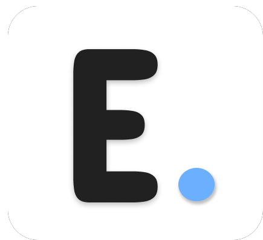

<a name="readme-top"></a>

[![Contributors][contributors-shield]][contributors-url]
[![Forks][forks-shield]][forks-url]
[![Stargazers][stars-shield]][stars-url]
[![Issues][issues-shield]][issues-url]
[![MIT License][license-shield]][license-url]
[![LinkedIn][linkedin-shield]][linkedin-url]


<!-- PROJECT LOGO -->
<br />
<div align="center">
  <a href="https://github.com/othneildrew/Best-README-Template">
    
  </a>

  <h3 align="center">Ease.ai</h3>

  <p align="center">
    Your AI copilot for automating Youtube tasks with ease
    <br />
    <a href="https://github.com/othneildrew/Best-README-Template"><strong>Explore the docs »</strong></a>
    <br />
    <br />
    <a href="https://github.com/othneildrew/Best-README-Template">View Demo</a>
    ·
    <a href="https://github.com/othneildrew/Best-README-Template/issues">Report Bug</a>
    ·
    <a href="https://github.com/othneildrew/Best-README-Template/issues">Request Feature</a>
  </p>
</div>


<!-- TABLE OF CONTENTS -->
<details>
  <summary>Table of Contents</summary>
  <ol>
    <li>
      <a href="#about-the-project">About The Project</a>
      <ul>
        <li><a href="#built-with">Built With</a></li>
      </ul>
    </li>
    <li>
      <a href="#getting-started">Getting Started</a>
      <ul>
        <li><a href="#prerequisites">Prerequisites</a></li>
        <li><a href="#installation">Installation</a></li>
      </ul>
    </li>
    <li><a href="#usage">Usage</a></li>
    <li><a href="#roadmap">Roadmap</a></li>
    <li><a href="#contributing">Contributing</a></li>
    <li><a href="#license">License</a></li>
    <li><a href="#contact">Contact</a></li>
  </ol>
</details>


<!-- ABOUT THE PROJECT -->
## About The Project

[![Product Name Screen Shot][product-screenshot]](https://example.com)

Ease AI, where we harness the power of artificial intelligence to simplify your life and boost your productivity. Our goal is to create a seamless AI copilot that automates your day-to-day tasks, making technology work for you in the most efficient way possible. Whether you're a business looking to streamline operations or an individual aiming to make daily routines less tedious, Ease AI is here to assist.

### Project Spotlight: YouTube Video Transcription and Summarization

One of our standout projects is an AI-driven tool that automatically transcribes YouTube videos and provides concise, easy-to-digest summaries. This feature is perfect for anyone looking to quickly grasp the essence of a video without spending time watching it in its entirety. Plus, the summarized content can be effortlessly shared or commented on, enhancing engagement and accessibility.


<p align="right">(<a href="#readme-top">back to top</a>)</p>


### Built With

Our project is built using a combination of JavaScript, React, TypeScript and Flask. The frontend of the chrome extension which includes the sidebar and popup are built with react and the Backend of the project is built using flask. 

* Flask
* React
* Javascript

<p align="right">(<a href="#readme-top">back to top</a>)</p>


<!-- GETTING STARTED -->
## Getting Started

This section provides instructions on how to set up the Ease AI project on your local machine for development and testing purposes. Follow these steps to get your local environment ready.

### Prerequisites

Before you begin, ensure you have the following installed:

* npm (Node Package Manager) to manage the project's JavaScript dependencies.
  ```sh
  npm install npm@latest -g
  ```
* Python and Flask for the backend server. Ensure Python is installed on your system. Flask can be installed via pip, Python's package installer.


### Installation

To install and run the Ease AI project locally, follow these steps:

1. **Clone the repo**
   ```sh
   git clone https://github.com/your_username_/Project-Name.git
   ```

2. **Navigate to Backend Directory**
  ```sh
  cd backend
  ```
3. **Install NPM packages**
   ```sh
   npm install
   ```
4. **Activate Python Virtual Environment**
Set up and activate the Python virtual environment for Flask. This step may vary depending on your operating system.
  ```sh
  python -m venv venv
  .\venv\Scripts\activate
  ```
5. **Start the Flask Application**
With the virtual environment activated, start the Flask application.
  ```sh
  python app.py
  ```
6. **Environment Variables**
Create a .env file in the root directory of the project. Add your OpenAI API key to this file.
  ```sh
  OPENAI_API_KEY='YOUR_OPENAI_API_KEY_HERE'
  ```

7. **Load the Extension in Chrome**
To use the Ease AI Chrome extension, load it into the Chrome browser by enabling Developer Mode in the Chrome Extensions page (chrome://extensions/). Click on "Load unpacked" and select the extension directory from the Ease AI project.

8. **Run the Flask Server**
Ensure the Flask server is running in the background when using the Chrome extension to fetch and summarize YouTube video transcripts.

<p align="right">(<a href="#readme-top">back to top</a>)</p>


<!-- USAGE EXAMPLES -->
## Usage

This is the video of the current version of the chrome extension.


<p align="right">(<a href="#readme-top">back to top</a>)</p>


<!-- ROADMAP -->
## Roadmap

- [x] Integrate Open AI 
- [ ] Better UI and UX of the extension using react and typescript
- [ ] Add web automation and automatic comment posting on youtube 
- [ ] Reply to any text using custom mood options 
- [ ] Multiple LLM models integration 
- [ ] Analyze any youtube video or channel using automation

See the [open issues](https://github.com/othneildrew/Best-README-Template/issues) for a full list of proposed features (and known issues).

<p align="right">(<a href="#readme-top">back to top</a>)</p>


<!-- CONTRIBUTING -->
## Contributing

Contributions are what make the open source community such an amazing place to learn, inspire, and create. Any contributions you make are **greatly appreciated**.

If you have a suggestion that would make this better, please fork the repo and create a pull request. You can also simply open an issue with the tag "enhancement".
Don't forget to give the project a star! Thanks again!

<p align="right">(<a href="#readme-top">back to top</a>)</p>


<!-- LICENSE -->
## License

Distributed under the MIT License. See `LICENSE.txt` for more information.

<p align="right">(<a href="#readme-top">back to top</a>)</p>


<!-- CONTACT -->
## Contact

Chirag sharma - [@chirags93395286](https://twitter.com/chirags93395286) - chiragksharma15@gmail.com

<p align="right">(<a href="#readme-top">back to top</a>)</p>


<!-- ACKNOWLEDGMENTS
## Acknowledgments

Use this space to list resources you find helpful and would like to give credit to. I've included a few of my favorites to kick things off!

* [Choose an Open Source License](https://choosealicense.com)
* [GitHub Emoji Cheat Sheet](https://www.webpagefx.com/tools/emoji-cheat-sheet)
* [Malven's Flexbox Cheatsheet](https://flexbox.malven.co/)
* [Malven's Grid Cheatsheet](https://grid.malven.co/)
* [Img Shields](https://shields.io)
* [GitHub Pages](https://pages.github.com)
* [Font Awesome](https://fontawesome.com)
* [React Icons](https://react-icons.github.io/react-icons/search) -->


<!-- MARKDOWN LINKS & IMAGES -->
<!-- https://www.markdownguide.org/basic-syntax/#reference-style-links -->
[contributors-shield]: https://img.shields.io/github/contributors/othneildrew/Best-README-Template.svg?style=for-the-badge
[contributors-url]: https://github.com/othneildrew/Best-README-Template/graphs/contributors
[forks-shield]: https://img.shields.io/github/forks/othneildrew/Best-README-Template.svg?style=for-the-badge
[forks-url]: https://github.com/othneildrew/Best-README-Template/network/members
[stars-shield]: https://img.shields.io/github/stars/othneildrew/Best-README-Template.svg?style=for-the-badge
[stars-url]: https://github.com/othneildrew/Best-README-Template/stargazers
[issues-shield]: https://img.shields.io/github/issues/othneildrew/Best-README-Template.svg?style=for-the-badge
[issues-url]: https://github.com/othneildrew/Best-README-Template/issues
[license-shield]: https://img.shields.io/github/license/othneildrew/Best-README-Template.svg?style=for-the-badge
[license-url]: https://github.com/othneildrew/Best-README-Template/blob/master/LICENSE.txt
[linkedin-shield]: https://img.shields.io/badge/-LinkedIn-black.svg?style=for-the-badge&logo=linkedin&colorB=555
[linkedin-url]: https://linkedin.com/in/othneildrew
[product-screenshot]: images/screenshot.png
<!-- [Next.js]: https://img.shields.io/badge/next.js-000000?style=for-the-badge&logo=nextdotjs&logoColor=white
[Next-url]: https://nextjs.org/
[React.js]: https://img.shields.io/badge/React-20232A?style=for-the-badge&logo=react&logoColor=61DAFB
[React-url]: https://reactjs.org/
[Vue.js]: https://img.shields.io/badge/Vue.js-35495E?style=for-the-badge&logo=vuedotjs&logoColor=4FC08D
[Vue-url]: https://vuejs.org/
[Angular.io]: https://img.shields.io/badge/Angular-DD0031?style=for-the-badge&logo=angular&logoColor=white
[Angular-url]: https://angular.io/
[Svelte.dev]: https://img.shields.io/badge/Svelte-4A4A55?style=for-the-badge&logo=svelte&logoColor=FF3E00
[Svelte-url]: https://svelte.dev/
[Laravel.com]: https://img.shields.io/badge/Laravel-FF2D20?style=for-the-badge&logo=laravel&logoColor=white
[Laravel-url]: https://laravel.com
[Bootstrap.com]: https://img.shields.io/badge/Bootstrap-563D7C?style=for-the-badge&logo=bootstrap&logoColor=white
[Bootstrap-url]: https://getbootstrap.com
[JQuery.com]: https://img.shields.io/badge/jQuery-0769AD?style=for-the-badge&logo=jquery&logoColor=white
[JQuery-url]: https://jquery.com  -->
